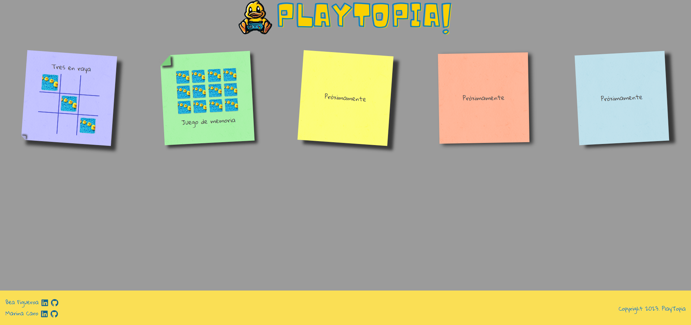

# MiniGames

Este proyecto es una colección de mini juegos creados con React. Tras finalizar el bootcamp de programación web de Adalab, mi maravillosa compi

## Contenido

- [Descripción](#descripción)
- [Capturas de Pantalla](#capturas-de-pantalla)
- [Contribuir](#contribuir)

## Descripción

MiniGames es una aplicación web que incluye varios juegos pequeños desarrollados con React. Disfruta de la diversión y desafío de estos juegos simples y entretenidos. Por el momento hemos desarrolla un juego de memory de buscar parejas y un 3 en raya.

## Capturas de Pantalla

_Clásico juego del 3 en raya, en el podrás poner el nombre de los jugadores y elegir los personajes con los que quieres juegar_

_Clásico juego de memoria de voltear cartas e ir descubriendo las parejas. En este juego podrás elegir entre varios niveles de dificultad, además de elegir los personajes de las cartas con los que jugar._

## Instrucciones de Uso

1. Clona este repositorio.
2. Instala las dependencias usando `npm install`.
3. Ejecuta la aplicación con `npm start`.
4. Abre tu navegador y visita `http://localhost:3000`.

## Contribuir

Si quieres contribuir a este proyecto, sigue estos pasos:

1. Haz un fork del repositorio.
2. Crea una nueva rama para tu función: `git checkout -b nueva-funcion`.
3. Haz tus cambios y haz commit: `git commit -m 'Añade nueva función'`.
4. Haz push a la rama: `git push origin nueva-funcion`.
5. Abre un pull request en GitHub.

## Autoras

- [Bea Figueroa](https://github.com/beafig)
- [Marina Caro](https://github.com/marinacr92)

  **¡Diviértete jugando!**

Espero que te haya gustado mi trabajo, si quieres saber un poco más o tienes cualquier consejo para mejorar mi código no dudes en ponerte en contacto conmigo. [LinkedIn](https://www.linkedin.com/in/bea-figueroa/)

Gracias por visitarme.
